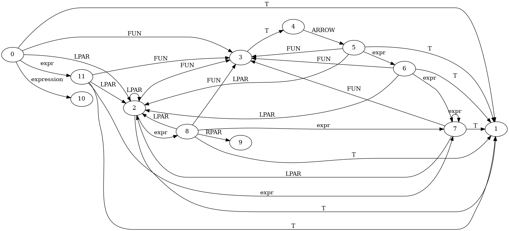

## Premiere partie PARSER

1. 

2. Nous avons plusieurs conflits shift-reduce et reduce-reduce si cette grammaire est SLR:
Etat 1 : Conflit shift-reduce.

Etat 6 : Conflit shift-reduce pour expr -> FUN T ARROW expr.
Etat 6 : Conflit reduce-reduce pour reduire soit sur expr -> FUN T ARROW expr ou expr -> expr expr.

Etat 7 : Conflit shift-reduce pour expr -> expr expr.
Etat 7 : Conflit reduce-reduce pour expr -> expr expr.

Etat 9 : Conflit shift-reduce pour expr -> LPAR expr RPAR.

Etat 11 : Conflit shift-reduce pour expression -> expr.

3. Il existe une séquence de tokens sur laquelle deux arbres de dérivations
sont possibles avec cet automate tel que "T T"
La Premiere façon en utilisante expr -> T et 
la seconde en utilisant expr -> expr expr 
Donc cela nous confirme que cette grammaire n'est pas deterministe et surtout que cette grammaire est en ambiguï.

4. Le parseur implémenté dans Parser_calc.mly choisit de traiter la séquence de tokens 
en fonction de la règle de grammaire qui correspond au premier token rencontré. 
Par exemple, si la séquence commence par FUN, comme dans FUN x = ID ARROW INT, 
il applique la règle expr pour analyser une fonction. 
Il associe x = ID, ce qui fait de x un paramètre, 
puis rencontre ARROW pour indiquer le corps de la fonction, 
qui dans cet exemple est un entier (INT). 
Le parseur crée un arbre syntaxique abstrait (AST) pour représenter la fonction avec le paramètre x et le corps INT. 
En résumé, sur cette séquence de tokens, le parseur choisit d'analyser une fonction et construit l'AST correspondant.

5. Il faudrait ajouter des priorités pour traiter correctement 
expr expr et FUN x = ID ARROW expr

En menhir, on peut définir les priorités de cette façon:
%left FUN ARROW
%left expr expr

6. Si on ajoute toutes les fonctions de built_in dans ce parseur, 
alors on va sans doute devoir rajouter les priorités vu précèdemment ainsi que cette dernière %left built_in.
De cette façon, on gére correctement l'interaction entre toutes ces règles et on peut garantir que ce parseur choisisse la bonne interprétation en cas de conflit.

7. A mon avis, en priorisant les non-terminaux distincts dans ce cas permettrait une meilleur gestion des conflits shift-reduce, et permettrait une reduction des ambiguïtés en permettant de mieux controler la structure de l'analyse syntaxique et de reduire les ambiguïtés du language.

### Seconde partie Parser Syntaxe Etendue

Dans cette section, nous avons étendu la grammaire de Mini-ML afin d'accepter une syntaxe plus lisible, en ajoutant plusieurs sucres syntaxiques courants. 
Toutes les modifications ont été faites dans les fichiers:
- language/Parser.mly 
- language/ast.* (ml et mli)
- interpreter.ml
- type_system.ml

##### Ajouts effectués

1. Notation infixe des opérateurs binaires

Nous avons ajouté une notation infixe pour les opérateurs arithmétiques et logiques afin de permettre des écritures telles que e1 + e2 au lieu de + e1 e2.

Implémentation :

* Définition d’une règle binop listant tous les opérateurs binaires.
* Attribution de priorités et associativités via les directives %left pour éviter les ambiguïtés de parsing.
* Règle expr -> expr binop expr pour gérer cette forme infixe.

Pour traiter entièrement la règle binop et éviter tous warning nous avons ajouté les cas non-exhaustif générés lors de la compilation dans les fichiers interpreter.ml et type_system.ml

Difficultés:

L’ajout de nombreux opérateurs binaires a entraîné des conflits de décalage/réduction et nous n'avons pas réussi à les résoudre via des systems de priorités tels que %left ADD SUB ou %left MUL DIV

2. Notation let avec arguments

Nous avons ajouté la possibilité d’écrire let f x y = e comme du sucre syntaxique pour let f = fun x -> fun y -> e.

Implémentation :

* Ajout d’une règle id_list pour collecter les arguments d’une fonction.
* Dans la règle req, nous utilisons List.fold_right pour transformer les arguments en applications successives de Fun

Difficultés:

Nous n'avons pas réussi à faire en sorte de reduire correctement cela, donc des conflits sont encore présents du à cette implémentation.

3. Moins unaire

L’expression -e est désormais interprétée comme neg e.

Implémentation :

* Dans la règle simple_expr, on ajoute un cas spécifique : SUB e = simple_expr, qui est transformé en App(Cst_func(UMin), e)

4. Listes constantes
Les expressions [1;2;3] sont désormais transformées en (::) 1 ((::) 2 ((::) 3 [])).

Implémentation :

* Ajout des règles list_literal et list_tail dans simple_expr.
* On utilise List.fold_right pour construire l’arbre syntaxique représentant l’application des opérateurs :: (ou Cat dans notre AST).

Difficultés :

L’ambiguïté entre la liste vide et les listes avec éléments a été résolue avec deux productions distinctes :

- L_SQ R_SQ pour la liste vide
- L_SQ expr list_tail R_SQ pour les listes non vides.

De plus on ajouter des priorités globales:

Nous avons défini les niveaux de priorité comme suit (du plus au moins prioritaire) :

Unaires : -, not → %nonassoc
Multiplicatifs : *, /, % → %left MUL DIV MOD
Additifs : +, - → %left ADD SUB
Listes : ::, @ → %right CAT APPEND
Concaténation de chaînes : ^ → %left CONCAT
Comparaisons : =, <>, <, >, <=, >= → %left EQ NEQ LT GT LEQ GEQ
Booléens : &&, || → %left AND OR

Malgré quelques conflits persistants dans le parseur, 
les extensions majeures de syntaxe ont été intégrées et fonctionnent sur des cas d’usage typiques. 
Les conflits restants sont liés à des ambiguïtés difficiles à lever sans refactorisation plus profonde, 
mais n’empêchent pas le fonctionnement du langage.